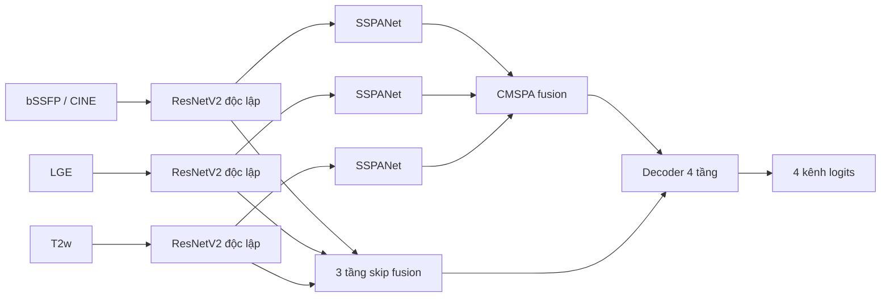

# SCAR: phân đoạn cơ tim đa phương thức với SSPANet + CMSPA

SCAR huấn luyện và đánh giá mô hình **CMSPA-Net (M3)** trên MyoPS-380, với ba ảnh đã đăng ký đồng bộ: **bSSFP/CINE, LGE, T2w**. Mỗi lát cắt cho một mask gồm bốn lớp: nền, cơ tim bình thường, phù nề và sẹo. Pipeline gồm kiểm tra dữ liệu, tách bệnh nhân, train, resume, đánh giá volume và xuất NIfTI.

## Kết luận rà soát kế hoạch và kiến trúc

Hướng tích hợp từ I_MMSeg là hợp lý. Phần cần sửa chủ yếu nằm ở sự nhất quán của pipeline, hợp đồng dữ liệu và cách mô tả attention. Bản triển khai này giữ ba encoder độc lập, SSPANet ở bottleneck của từng nhánh, fusion CMSPA, ba skip fusion và một decoder. Không giảm độ rộng hoặc số block của cấu hình nghiên cứu để phù hợp GPU laptop.

Các điều chỉnh so với kế hoạch ban đầu:

- **SSPANet có mô tả không nhất quán trong bài báo.** Hình 2 và demo tác giả giảm chiều **C** bằng max/mean, tạo `(B,2,H,W)`, rồi Conv 7×7 tạo gate `(B,1,H,W)`. Một số công thức (17–23) và phần văn bản lại mô tả attention tuần tự, pooling H/W và kernel khác. SCAR theo **Hình 2 + demo tác giả + triển khai I_MMSeg**, không tuyên bố đồng thời khớp mọi công thức mâu thuẫn đó.
- Strip statistic là **RMS `sqrt(mean(x²)+eps)`**, không phải độ lệch chuẩn có trừ trung bình. CMSPA dùng **population standard deviation theo C**, cộng hai bản đồ LGE/T2w; đây là hai phép thống kê khác nhau.
- Lớp `PreActBottleneck` giữ tên tương thích pretrained, nhưng thứ tự phép toán thực tế là hybrid ResNet của TransUNet (`conv → GroupNorm → ReLU`), không đổi sang một ResNet preactivation khác.
- Parity chạy từng repository trong subprocess riêng, so sánh logits, loss, gradient đầu vào và **mọi** gradient tham số; tránh việc vô tình so hai alias của cùng một lớp.
- Cache hiện có thiếu thông tin hình học vật lý. Pipeline giữ `HD95 mm = null` khi không có đơn vị đáng tin cậy. Không suy luận rằng affine identity có nghĩa là voxel 1 mm.
- Đã thay script/import thuộc pipeline LGE cũ, bỏ fallback sang dữ liệu giả khi nhập sai đường dẫn và tách các kiến trúc cũ vào `training/models/baselines/`.
- Không áp quy tắc morphology cũ lên nhãn MyoPS mới. Những quy tắc dùng “lớp 2 là cơ tim” sẽ xử lý sai vì lớp 2 hiện là phù nề. Mask mặc định là argmax của logits, tránh tự động xóa tổn thương nhỏ.

Bài báo SSPANet nghiên cứu **phân loại u não**, không xác nhận hiệu quả CMSPA trên cơ tim hoặc batch/LR tối ưu cho MyoPS. Kết quả kiểm thử phần mềm không thay thế thí nghiệm M0–M3 trên cùng split và ngân sách train.

## Kiến trúc và phép toán



M3 mặc định có **64.403.442 tham số**, backbone `(3,4,9)` với `width_factor=1.0`. Đầu vào là ba tensor riêng `(B,1,128,128)`; mỗi nhánh lặp ảnh xám thành ba kênh để tương thích trọng số encoder. Bottleneck mỗi nhánh `(B,1024,8,8)`; CMSPA đưa về `(B,512,8,8)`; skip có 512/256/64 kênh tại 16²/32²/64². Đầu ra là **raw logits `(B,4,128,128)` cả trong train và eval**.

SSPANet dùng hai nhánh song song trên cùng `X`:

```text
Z = concat(max_C(X), mean_C(X))
CA(X) = X * sigmoid(BN(Conv7x7(Z)))
R_h = sqrt(mean_W(X²) + eps)
R_w = sqrt(mean_H(X²) + eps)
SA(X) = X * sigmoid(Conv1x1(BN(Conv3x1(R_h)) + BN(Conv1x3(R_w))))
SSPA(X) = X + X * sigmoid(CA(X) + SA(X))
```

Phép chiếu 1×1 được thực hiện trước broadcast, cộng bias đúng một lần. Đây là phép biến đổi đại số tương đương, giảm tính toán mà giữ cấu trúc. RMS/variance và loss tích lũy ở FP32 khi dùng AMP.

CMSPA tạo gate giải phẫu từ tổng hai mean strip của CINE; gate bệnh lý từ `std_C(LGE) + std_C(T2w)`. Fusion nhận `concat(CINE + CINE*P, LGE*A, T2w*A)` rồi Conv1×1 + BN + ReLU. Các gate là đặc trưng học được, không phải mask giải phẫu được bảo đảm đúng.

| Ablation | Attention từng nhánh | Fusion bottleneck | YAML |
|---|---|---|---|
| M0 | Không | Concat | `concat_baseline.yaml` |
| M1 | SSPANet | Concat | `sspanet_baseline.yaml` |
| M2 | SSPANet | Cross-attention | `cross_attn_baseline.yaml` |
| M3 | SSPANet | CMSPA | `cmspa_net.yaml` |

Các YAML nằm trong `training/config/models/`. `testing.yaml` dùng mạng nhỏ cho kiểm thử, không dùng để báo cáo thí nghiệm M3 đầy đủ. Các U-Net/ResUNet++ cũ trong `baselines/` chỉ giữ để tái sử dụng kiến trúc, chưa có adapter cho pipeline ba modality này.

## Cài đặt

Python **3.11 hoặc 3.12**, PyTorch **2.3 đến dưới 3**, CPU hoặc CUDA. Cài bản PyTorch phù hợp CUDA của máy trước nếu môi trường chưa có; `requirements.txt` không cố định CUDA theo laptop.

```bash
python -m pip install -r requirements.txt
python -c "import torch; print(torch.__version__, torch.cuda.is_available())"
```

`h5py` đọc volume; `nibabel` giữ NIfTI/affine; `ml-collections` lưu cấu hình model; TensorBoard, CSV và JSONL phục vụ theo dõi. Chạy lệnh từ thư mục gốc SCAR. Linux/A100 cần truyền đường dẫn dữ liệu thực tế thay cho đường dẫn ổ E của máy Windows.

## Dữ liệu, nhãn và split

| ID canonical | Ý nghĩa |
|---|---|
| 0 | Background |
| 1 | Normal myocardium |
| 2 | Edema |
| 3 | Scar |

Cache legacy I_MMSeg dùng `2=scar, 3=edema`, được đổi **một lần** bằng ánh xạ `[0,1,3,2]`. `--label-order auto` ưu tiên metadata trong từng file; nếu thiếu, cảnh báo rồi giả định legacy. Không thể tự xác định ý nghĩa lớp 2/3 chỉ từ giá trị số. Dùng `--label-order canonical` cho dữ liệu đã canonical nhưng chưa có metadata. Khi lựa chọn tường minh mâu thuẫn với metadata, loader báo lỗi.

```text
Raw_data/
  bSSFP/caseXXXX.nii.gz
  LGE/caseXXXX.nii.gz
  T2w/caseXXXX.nii.gz
  label/caseXXXX_gt.nii.gz
Processed_data/
  bSSFP/{train_npz,val_vol_h5,test_vol_h5}/...
  LGE/{train_npz,val_vol_h5,test_vol_h5}/...
  T2w/{train_npz,val_vol_h5,test_vol_h5}/...
  dataset_metadata.json                 # Có với cache do SCAR tạo mới
```

- NPZ chứa ảnh/nhãn `(H,W)`, HDF5 `.npy.h5` chứa `(H,W,D)`. Cả ba modality phải khớp ID, shape, mask và metadata hình học.
- Đầu vào đã đăng ký từ trước. Kiểm tra header không chứng minh được căn chỉnh giải phẫu; pipeline không tự đăng ký hoặc chọn crop từ nhãn.
- Chuẩn hóa trước augmentation: `unit255` chia 255, `unit` xác nhận [0,1], `percentile` dùng phân vị 1–99 của vùng khác 0. Xoay/lật/dịch áp dụng đồng bộ; intensity/noise áp dụng riêng từng modality. Nhãn resize nearest; ảnh resize bilinear.
- Danh sách **76 bệnh nhân test** được giữ ở `preprocessing/splits/test_vol.txt`. Trong 304 ca còn lại, seed 1234 tách **243 train / 61 validation**, tương ứng **1.578 / 394 lát cắt** trong cache đã kiểm tra. Không chia ngẫu nhiên ở mức slice.
- Manifest train/val/val_vol/test_vol được tạo ở `data/processed/splits/` và chụp lại trong mỗi run. Đã có split thì xác thực và giữ nguyên, không đổi theo seed mới.
- Cache hiện có tại `E:/STUDY/DATASET/MyoPS380/Processed_data` có 1.972 NPZ + 76 HDF5 mỗi modality. Thiếu `val_vol_h5` thì loader ghép toàn bộ slice của bệnh nhân validation theo chỉ số liên tục từ 0; không ghi vào cache gốc.
- Kiểm tra toàn bộ 380 bộ header raw cho thấy affine identity và đơn vị không xác định. Cache hiện có không lưu affine/spacing. Để báo cáo khoảng cách mm, cần lấy hình học thật từ nguồn dữ liệu; không gán mặc định 1 mm.

## Chạy với cache hiện có

Lệnh sau xác thực cache, tạo split nếu cần, train M3 và đánh giá volume test bằng checkpoint tốt nhất theo validation:

```bash
python run_all.py --run-id m3_run01 --skip-cache --label-order legacy
```

Trên A100/Linux, ví dụ dữ liệu đặt tại `/data/MyoPS380/Processed_data`:

```bash
python run_all.py --run-id m3_a100_01 --data-root /data/MyoPS380/Processed_data --skip-cache --label-order legacy
```

`train.sh` và `train.ps1` chuyển tiếp nguyên đối số sang `run_all.py`:

```bash
bash train.sh --run-id m3_run01 --skip-cache --label-order legacy
```

```powershell
.\train.ps1 --run-id m3_run01 --skip-cache --label-order legacy
```

Có thể thêm `--skip-evaluate` trong giai đoạn phát triển để dành test cho đánh giá cuối. Không dùng điểm test để chọn hyperparameter. `--data-root` luôn là **cache đã xử lý**; raw dùng `--raw-root`. Cache có sẵn được tái sử dụng và kiểm tra. `--skip-cache` yêu cầu cache tồn tại; đường dẫn sai sẽ báo lỗi.

## Tham số train mặc định và batch 16

| Tham số | Mặc định | Lý do |
|---|---|---|
| Batch size | **16** | 16 bộ ảnh đồng bộ; không phải 48 mẫu độc lập |
| Gradient accumulation | 1 | Batch thực 16 cho thống kê BatchNorm |
| Kích thước | 128×128 | Khớp grid cache hiện tại và kiến trúc encoder/decoder |
| AdamW LR | **0.001** | Giữ baseline huấn luyện của I_MMSeg, chưa coi là LR tối ưu thực nghiệm |
| Weight decay | 0.0001 | Regularization tách khỏi bước gradient Adam |
| Epochs | 300 | Ngân sách cố định để so sánh ablation |
| Scheduler | Polynomial, power 0.9 | Theo số optimizer update thành công |
| Loss | 0.5 CE + 0.5 Dice | Dice theo từng ảnh, trung bình cả 4 lớp, mẫu số bình phương |
| AMP | auto | CUDA ưu tiên BF16 nếu hỗ trợ, còn lại FP16 + GradScaler; CPU FP32 |
| Clip gradient norm | 1.0 | Chặn gradient lớn |
| Workers | 4 | Có thể đổi theo hệ thống/I/O, không đổi model |
| Gradient checkpointing | false | Chỉ bật khi cần tiết kiệm activation memory |
| Sampler | none | Shuffle thông thường, không đổi phân phối mặc định |
| Early stopping | tắt (`patience=0`) | Cùng ngân sách epoch cho các ablation |

**Batch 16 hợp lý làm điểm bắt đầu** cho M3 128² trên A100: hình dạng forward đã được kiểm tra với B=16 và encoder dùng GroupNorm; attention/decoder dùng BatchNorm. Chưa có benchmark A100 trong phiên local này nên không khẳng định VRAM/throughput hoặc batch tối ưu. Không tự giảm batch/LR theo GPU laptop và không tự scale LR khi đổi batch.

Effective batch là `batch_size × accum_steps` (nhóm cuối có thể nhỏ hơn). Accumulation cân theo số mẫu, kể cả microbatch cuối không đầy. Tuy nhiên BatchNorm vẫn thấy microbatch; `batch=2, accum=8` không tương đương hoàn toàn với batch thực 16.

Loss Dice: `1 - mean_(ảnh,lớp)((2*sum(p*y)+1e-5)/(sum(p²)+sum(y)+1e-5))`. CE/Dice tính FP32. Checkpoint `best.pth` dựa trên **pixel-pooled mean foreground Dice** của toàn tập validation, loại lớp vắng đồng thời ở prediction và target. Đây không phải trung bình Dice từng batch hoặc trung bình từng bệnh nhân.

Tham khảo cơ chế precision tại [PyTorch AMP](https://docs.pytorch.org/docs/stable/amp) và optimizer tại [PyTorch AdamW](https://docs.pytorch.org/docs/2.9/generated/torch.optim.adamw.AdamW.html).

## Các bước riêng và tạo cache mới

```bash
python preprocessing/build_splits.py --data-root E:/STUDY/DATASET/MyoPS380/Processed_data
python preprocessing/verify.py --data-root E:/STUDY/DATASET/MyoPS380/Processed_data --label-order legacy
python training/train.py --config training/config/models/cmspa_net.yaml --run-id m3_run01 --label-order legacy
```

Tạo **cache mới** trong một thư mục trống, giữ test cố định:

```bash
python preprocessing/process_and_save.py --src-path E:/STUDY/DATASET/MyoPS380/Raw_data --dst-path data/processed/cache --list-dir data/processed/new_splits --label-order legacy --normalization unit255
python training/train.py --run-id m3_new_cache --data-root data/processed/cache --list-dir data/processed/new_splits --label-order canonical
```

Preprocessing ghi provenance, SHA256 nguồn, nhãn canonical, affine, spacing và đơn vị vào cache mới. Đơn vị meter/micron được chuyển sang mm khi header khai báo; `unknown` giữ nguyên. Chỉ dùng `--spatial-unit` khi có thông tin nguồn xác thực. Thư mục đích hoặc manifest không rỗng sẽ bị từ chối ghi đè.

Tùy chọn thí nghiệm: `--pretrained encoder.npz` nạp cùng bộ trọng số vào ba encoder độc lập; `--sampler rare --rare-boost 2 --foreground-boost 1.3` ưu tiên slice chứa scar. Cả hai đều là lựa chọn tường minh, cần ghi nhận khi so sánh ablation.

## Resume và kết quả

Mỗi run ở `outputs/runs/<run-id>/` chứa `config.json`, `splits/`, `best.pth`, `last.pth`, `train.log`, `metrics.csv`, `metrics.jsonl`, `summary.json`, và `tensorboard/` nếu bật. Checkpoint lưu model, optimizer, scheduler, scaler, RNG Python/NumPy/Torch/CUDA, generator DataLoader, epoch, update, early-stopping state, nhãn và hash split.

Tạm dừng sau một epoch nhưng giữ lịch LR 300 epoch:

```bash
python training/train.py --run-id m3_long --epochs 300 --epochs-per-run 1 --label-order legacy
python training/train.py --resume outputs/runs/m3_long/last.pth --epochs 300 --label-order legacy
```

Khi resume phải giữ nguyên cấu hình model, dữ liệu, batch, accumulation, loss, LR, sampler và các thiết lập tái lập. Dùng lại các CLI override/YAML của lần đầu. Chỉ resume `last.pth` vào run gốc, ở ranh giới epoch; không có resume giữa batch. Resume chính xác đã được kiểm tra trên cùng môi trường CPU. Chuyển máy/phiên bản CUDA không được bảo đảm bitwise giống nhau.

```bash
tensorboard --logdir outputs/runs
```

## Đánh giá volume và dự đoán NIfTI

```bash
python training/evaluate.py --checkpoint outputs/runs/m3_run01/best.pth --data-root E:/STUDY/DATASET/MyoPS380/Processed_data --split test_vol
python training/evaluate.py --checkpoint outputs/runs/m3_run01/best.pth --data-root E:/STUDY/DATASET/MyoPS380/Processed_data --split val_vol
```

Ảnh từng slice được resize vào model; **logits được resize về grid gốc trước argmax**, rồi ghép `(H,W,D)`. Báo cáo `evaluation_<split>/per_case.csv` và `metrics.json` gồm Dice/IoU/HD95 cho normal, edema, scar, `edema_inclusive={2,3}` và `myocardial_ring={1,2,3}`. Các vùng hợp không phải một lớp huấn luyện mới.

- Cả prediction và target rỗng: overlap/HD95 không xác định (`null`), kèm số ca được tính.
- Chỉ một bên rỗng: Dice/IoU = 0, HD95 = null.
- HD95 là phân vị 95 của tập khoảng cách bề mặt hai chiều. Spacing phải theo đúng H,W,D, có đơn vị mm và grid trực giao. Grid shear bị từ chối khi tính khoảng cách vật lý.
- Thiếu geometry: `hd95_mm=null`; `--allow-voxel-spacing` cho phép báo **HD95 voxel riêng**, không trộn với mm. `--spacing H_MM W_MM D_MM` chỉ dùng khi đã biết spacing thật áp dụng cho tất cả ca trong lệnh.
- NPZ dự đoán lưu được cả khi thiếu geometry. Chỉ xuất NIfTI từ cache khi có affine hợp lệ; không dựng affine giả cho cache legacy.

Dự đoán trực tiếp trên ba NIfTI đã đăng ký, bảo toàn shape/affine/đơn vị của bSSFP:

```bash
python training/predict.py --checkpoint outputs/runs/m3_run01/best.pth --cine /data/raw/bSSFP/case0001.nii.gz --lge /data/raw/LGE/case0001.nii.gz --t2w /data/raw/T2w/case0001.nii.gz --normalization unit255 --output outputs/case0001_pred.nii.gz
```

`--normalization` phải giống preprocessing của tập train. File dự đoán dùng nhãn canonical, kèm JSON provenance; không ghi đè file đã có. `predict.sh` chuyển tiếp các đối số của CLI này.

## Kiểm thử local

```bash
python -m pytest tests -q
python tools/sanity_check.py --profile testing --device cuda --amp auto --image-size 32
python tools/verify_parity.py --source-root D:/NCKH/I_MMSeg
python tools/verify_parity.py --source-root D:/NCKH/I_MMSeg --profile production --ablations M3 --image-size 128
python tools/smoke_pipeline.py --raw-root E:/STUDY/DATASET/MyoPS380/Raw_data
```

`smoke_pipeline.py` chạy **M3 đầy đủ 64,4 triệu tham số, ảnh 128², batch 1, một epoch với 2 slice train + 1 slice validation, 1 bệnh nhân test** trên CPU. Nó kiểm tra checkpoint, đánh giá volume và NIfTI nếu truyền raw-root; giữ log nhỏ ở `outputs/verification/local_epoch/`, tự xóa checkpoint tạm. Dùng `--output` khác để chạy lại. Đây là kiểm tra thực thi trên tập con nhỏ; điểm Dice của smoke không phải kết quả nghiên cứu.

Kết quả kiểm tra ngày 07/09/2026: **56 tests và 13 subtests đạt**. Parity M0–M3 trên cấu hình testing và M3 production 128² đều có max absolute error **0** cho logits/loss/gradient; production M3 có **551 tensor gradient** kết nối. Một epoch dữ liệu thật đã hoàn tất, NIfTI giữ đúng affine và đơn vị `unknown`. CUDA/BF16 forward-backward-AdamW trên cấu hình testing cũng đạt. Chưa chạy train đầy đủ 300 epoch hoặc benchmark A100.

## Cấu trúc repository

```text
SCAR/
├── preprocessing/           # Đọc NIfTI, normalization, đóng gói, split, verify
│   └── splits/test_vol.txt  # 76 bệnh nhân test cố định, theo dõi trong Git
├── training/
│   ├── config/             # base.yaml + YAML M0–M3 và testing
│   ├── dataset/            # Một loader MyoPS, data contract, sampler tùy chọn
│   ├── models/             # CMSPA-Net, backbones/, modules/, baselines/ cũ
│   ├── loss/               # CE + squared-denominator Dice
│   ├── metrics/            # Confusion matrix và khoảng cách bề mặt
│   ├── trainer/            # Optimizer, AMP, scheduler, checkpoint và log
│   ├── train.py
│   ├── evaluate.py
│   └── predict.py
├── tools/                  # Sanity, parity độc lập, smoke một epoch
├── tests/                  # Test data/model/loss-metrics/training pipeline
├── run_all.py
├── scar_pipeline.ipynb     # Notebook Colab dùng cùng CLI/YAML
├── install.sh / train.sh / train.ps1 / predict.sh
├── requirements.txt
└── README.md               # Tài liệu Markdown duy nhất
```

Các bản sao migration, pipeline hậu xử lý LGE cũ và test dựa trên hợp đồng nhãn cũ đã được loại bỏ. Test hiện tại bảo vệ hợp đồng MyoPS mới, loss, attention, augmentation đồng bộ, chống leakage, accumulation, resume, đánh giá vật lý và các CLI. Dữ liệu và kết quả chạy nằm ngoài Git; nguồn raw/cache hiện có không bị ghi lại.

## Tham khảo

- Hasan et al., *Enhancing brain tumor classification with a novel attention based explainable deep learning framework*, Biomedical Signal Processing and Control 112 (2026), 108636. [DOI](https://doi.org/10.1016/j.bspc.2025.108636). Đối chiếu Hình 2, Hình 3 và mục 3.5 với demo `sspanet_demo.py` của tác giả.
- I_MMSeg: mã nguồn kiến trúc M0–M3 dùng làm tham chiếu migration; `tools/verify_parity.py --source-root ...` là phụ thuộc tùy chọn để đối chiếu, không cần I_MMSeg để train SCAR.
