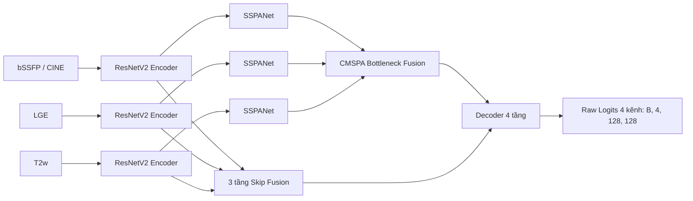

# SCAR: Phân đoạn Cơ tim Đa phương thức với SSPANet + CMSPA

<p align="center">
  <a href="https://colab.research.google.com/github/thanhquan123hi1/SCAR/blob/main/scar_pipeline.ipynb">
    
  </a>
  
  
  
  
</p>

---

## 📖 Giới thiệu tổng quan

**SCAR** là hệ thống học sâu tiên tiến phục vụ phân đoạn tổn thương cơ tim đa phương thức trên tập dữ liệu cộng hưởng từ tim mạch **MyoPS-380**, kết hợp đồng thời ba chuỗi xung CMR đã căn chỉnh đồng bộ:
* **bSSFP / CINE** (Cine Balanced Steady-State Free Precession - cấu trúc giải phẫu chuyển động)
* **LGE** (Late Gadolinium Enhancement - tổn thương sẹo cơ tim)
* **T2w** (T2-weighted - vùng phù nề cơ tim)

Mô hình chủ lực **CMSPA-Net (M3)** kết hợp **3 encoder ResNetV2 độc lập**, khối chú ý không gian-kênh **SSPANet** (RMS Strip Pooling Attention), cơ chế hòa trộn **CMSPA** (Cross-Modal Strip Pathology Attention), 3 tầng skip fusion và 1 decoder 4 cấp, xuất trực tiếp raw logits 4 kênh chuẩn hóa (**canonical**):
1. `Lớp 0`: Nền (Background)
2. `Lớp 1`: Cơ tim lành (Normal Myocardium)
3. `Lớp 2`: Phù nề (Edema)
4. `Lớp 3`: Sẹo cơ tim (Scar)

---

## 📑 Mục lục
- [🚀 Chạy nhanh trên Google Colab](#-chạy-nhanh-trên-google-colab)
- [🏗️ Kiến trúc Mô hình CMSPA-Net (M3)](#️-kiến-trúc-mô-hình-cmspa-net-m3)
- [🔬 Các cấu hình nghiên cứu (Ablation Studies M0–M3)](#-các-cấu-hình-nghiên-cứu-ablation-studies-m0m3)
- [📦 Hợp đồng Dữ liệu & Quy ước Nhãn Canonical](#-hợp-đồng-dữ-liệu--quy-ước-nhãn-canonical)
- [🛠️ Cài đặt Môi trường](#️-cài-đặt-môi-trường)
- [🏋️ Huấn luyện Mô hình](#️-huấn-luyện-mô-hình)
- [📊 Đánh giá & Xuất kết quả NIfTI](#-đánh-giá--xuất-kết-quả-nifti)
- [📂 Cấu trúc Repository](#-cấu-trúc-repository)
- [📚 Tài liệu Tham khảo](#-tài-liệu-tham-khảo)

---

## 🚀 Chạy nhanh trên Google Colab

Bạn có thể chạy toàn bộ quy trình từ tải dữ liệu, tiền xử lý, huấn luyện M3 đến đánh giá volume 3D chỉ với một cú nhấp chuột:

<p align="center">
  <a href="https://colab.research.google.com/github/thanhquan123hi1/SCAR/blob/main/scar_pipeline.ipynb" target="_blank">
    
  </a>
</p>

* File notebook: [`scar_pipeline.ipynb`](scar_pipeline.ipynb)
* Tự động kết nối Google Drive, nạp bộ dữ liệu `MyoPS380_dataset` và trọng số tiền huấn luyện `R50-ViT-B_16.npz`.
* Hỗ trợ lưu trữ checkpoints (`best.pth`, `last.pth`) và đồ thị huấn luyện trực tiếp về Google Drive cá nhân.

---

## 🏗️ Kiến trúc Mô hình CMSPA-Net (M3)



### Thông số kỹ thuật & Công thức cốt lõi:
* **Tham số mô hình**: **64.403.442 tham số** ở cấu hình đầy đủ `(3, 4, 9)`, `width_factor=1.0`.
* **Khối SSPANet (Strip Pooling Attention)**:
  $$Z = \text{Concat}(\text{MaxPool}_C(X), \text{MeanPool}_C(X))$$
  $$\text{CA}(X) = X \odot \sigma(\text{BN}(\text{Conv}_{7\times 7}(Z)))$$
  $$R_h = \sqrt{\text{Mean}_W(X^2) + \epsilon}, \quad R_w = \sqrt{\text{Mean}_H(X^2) + \epsilon}$$
  $$\text{SA}(X) = X \odot \sigma\Big(\text{Conv}_{1\times 1}\big(\text{BN}(\text{Conv}_{3\times 1}(R_h)) + \text{BN}(\text{Conv}_{1\times 3}(R_w))\big)\Big)$$
  $$\text{SSPA}(X) = X + X \odot \sigma(\text{CA}(X) + \text{SA}(X))$$
* **Khối CMSPA Bottleneck Fusion**:
  * **Anatomy Gate ($A$)**: Trích xuất từ tổng trung bình strip không gian của CINE: $\sigma(\text{Conv}(\text{Mean}_W(C) + \text{Mean}_H(C)))$.
  * **Pathology Gate ($P$)**: Trích xuất từ độ lệch chuẩn kênh của LGE và T2w: $\sigma(\text{Conv}(\text{std}_C(\text{LGE}) + \text{std}_C(\text{T2w})))$.
  * **Fusion**: $\text{Concat}(C + C \odot P, \text{LGE} \odot A, \text{T2w} \odot A) \xrightarrow{\text{Conv}_{1\times 1} + \text{BN} + \text{ReLU}} 512 \text{ channels}$.

---

## 🔬 Các cấu hình nghiên cứu (Ablation Studies M0–M3)

| Mã Ablation | Attention từng nhánh | Fusion Bottleneck | File cấu hình YAML |
|:---:|:---:|:---:|:---:|
| **M0** | Không sử dụng | Concat đơn giản | [`training/config/models/concat_baseline.yaml`](training/config/models/concat_baseline.yaml) |
| **M1** | SSPANet | Concat đơn giản | [`training/config/models/sspanet_baseline.yaml`](training/config/models/sspanet_baseline.yaml) |
| **M2** | SSPANet | Cross-Attention | [`training/config/models/cross_attn_baseline.yaml`](training/config/models/cross_attn_baseline.yaml) |
| **M3 (Đề xuất)** | **SSPANet** | **CMSPA** | [`training/config/models/cmspa_net.yaml`](training/config/models/cmspa_net.yaml) |

---

## 📦 Hợp đồng Dữ liệu & Quy ước Nhãn Canonical

### Bảng nhãn Canonical chuẩn hóa:
| ID Lớp | Tên nhãn | Định nghĩa giải phẫu |
|:---:|:---|:---|
| **0** | `background` | Nền và các mô ngoài tim |
| **1** | `normal_myocardium` | Vùng cơ tim lành (không bao gồm phù nề và sẹo) |
| **2** | `edema` | Vùng phù nề cơ tim (tổn thương cấp tính) |
| **3** | `scar` | Vùng sẹo tổn thương cơ tim (tổn thương mạn tính) |

> [!IMPORTANT]
> **Tương thích ngược dữ liệu Legacy:**
> Bộ cache cũ của I_MMSeg dùng quy ước `2=scar, 3=edema`. Chọn `--label-order legacy` cho cache tác giả; chọn `canonical` cho cache mới do SCAR đóng gói. Hệ thống kiểm tra metadata nếu có và hoán vị về chuẩn canonical `[0, 1, 3, 2]` thông qua [`data_contract.py`](training/dataset/data_contract.py).

### Phân chia Dataset (Patient-level Split):
* **Tổng số ca:** 380 bệnh nhân (MyoPS-380).
* **Test set cố định:** **76 bệnh nhân** (lưu tại [`preprocessing/splits/test_vol.txt`](preprocessing/splits/test_vol.txt)).
* **Train / Validation:** 304 bệnh nhân còn lại được phân chia chặt chẽ theo tỷ lệ ca bệnh (**243 Train / 61 Validation**), tương đương **1.578 lát cắt train / 394 lát cắt val**. Tuyệt đối không rò rỉ (0% data leakage) giữa các tập.

---

## 🛠️ Cài đặt Môi trường

Yêu cầu: **Python 3.11 hoặc 3.12**, **PyTorch ≥ 2.3**.

```bash
# Clone repository
git clone https://github.com/thanhquan123hi1/SCAR.git
cd SCAR

# Cài đặt các thư viện phụ thuộc
pip install -r requirements.txt

# Kiểm tra môi trường GPU
python -c "import torch; print('PyTorch:', torch.__version__, '| CUDA Available:', torch.cuda.is_available())"
```

---

## 🏋️ Huấn luyện Mô hình

### Cách 1: Tự động hóa toàn diện với `run_all.py` (Khuyên dùng)
Tự động kiểm tra cache, tạo split bệnh nhân, kiểm định dữ liệu, huấn luyện mô hình M3 và đánh giá volume test:

```bash
python run_all.py --run-id m3_run01 --skip-cache --label-order legacy
```

### Cách 2: Huấn luyện chi tiết qua CLI
```bash
python train.py \
    --config training/config/models/cmspa_net.yaml \
    --ablation M3 \
    --data-root /path/to/Processed_data \
    --list-dir data/processed/splits \
    --output-dir outputs/runs/m3_run01 \
    --batch-size 16 \
    --lr 0.001 \
    --epochs 300 \
    --amp auto \
    --pretrained model/vit_checkpoint/imagenet21k/R50-ViT-B_16.npz
```

*(Đối với GPU nhỏ 4GB–6GB: hãy dùng `--batch-size 2 --accum-steps 8`).*

### Khôi phục huấn luyện (Resume):
```bash
python train.py --resume outputs/runs/m3_run01/last.pth
```

---

## 📊 Đánh giá & Xuất kết quả NIfTI

Đánh giá checkpoint tốt nhất trên tập dữ liệu kiểm thử 3D:
```bash
python test.py \
    --checkpoint outputs/runs/m3_run01/best.pth \
    --data-root /path/to/Processed_data \
    --split test_vol \
    --batch-size 8 \
    --save-predictions
```

Báo cáo kết quả được lưu tại `outputs/runs/m3_run01/evaluation_test_vol/` gồm:
* `per_case.csv`: Chi tiết Dice, IoU, HD95, ASD cho từng ca bệnh.
* `metrics.json`: Điểm theo bệnh nhân, protocol, hash dữ liệu và số ca metric xác định/không xác định.
* Mask `.npz`; chỉ xuất thêm NIfTI khi cache có affine hợp lệ. Không tạo geometry giả cho cache legacy.

---

## Protocol benchmark đã khóa (Phase 1)

Protocol `myops380_voxel_v1` tính HD95/ASD trên lưới voxel đơn vị (`voxelspacing=None`), không phải mm. Dữ liệu đã chuẩn hóa in-plane; spacing z vật lý không có trong bản phát hành và không được suy diễn từ affine identity. Không cần truyền `--spacing` hoặc `--allow-voxel-spacing`.

- Nhãn đầu ra canonical: `0=background, 1=normal_myocardium, 2=edema, 3=scar`. Cache chính thức thiếu metadata dùng `--label-order legacy`; cache SCAR mới dùng `canonical`. `auto` không còn đoán nhãn cho file thiếu metadata.
- Region độc lập: normal `[1]`, edema `[2]`, scar `[3]`; region hợp: edema-inclusive `[2,3]`, myocardial ring `[1,2,3]`. Không tự coi region hợp là cột tương ứng trong paper.
- Metric chính: cả hai mask rỗng thì Dice/IoU/HD95 không xác định; một mask rỗng thì Dice/IoU bằng 0, distance không xác định. Trung bình chỉ dùng giá trị xác định và luôn kèm số ca, trạng thái empty.
- `avg_pathology_dice` = trung bình của hai patient-mean Dice scar và edema riêng (cần cả hai giá trị xác định). Dice lưu trong [0,1]. Metric này trên **validation volume** chọn `best.pth` và điều khiển early stopping; test không tham gia chọn mô hình.
- `official_dice`, `official_hd95_voxel` và `official_avg_pathology_dice` là kết quả evaluator I-MMSeg tái lập trên cùng prediction. Giữ nguyên ngoại lệ upstream: nếu một mask rỗng, trả Dice=1 khi pred<200 và GT<=200 voxel, ngược lại Dice=0; HD95=0. Các điểm này được báo riêng, không dùng để chọn checkpoint. Đây là parity của evaluator, không phải tuyên bố tái lập toàn bộ training của paper.
- 76 ID test chính thức được khóa bằng hash; 304 ca còn lại chia train/val. Hash nội dung cache, quy ước nhãn, protocol và hash manifest được lưu trong `config.json`, checkpoint và báo cáo evaluation. Resume/evaluation từ chối thay đổi dữ liệu, đổi nhãn hoặc đổi split; evaluation không nhận tập con của split đã lưu.
- Checkpoint cũ chưa lưu protocol không được resume/evaluate trong chế độ benchmark đã khóa. Cần bắt đầu run Phase 1 mới; không tái sử dụng best score từ metric cũ. Chạy lại evaluation phải chọn thư mục đầu ra mới nếu thư mục cũ đã có dữ liệu.

`val/mean_dice` trong log vẫn là chỉ số pixel-pooled phụ; đường chọn checkpoint là `val/avg_pathology_dice`. Mỗi epoch có thêm lượt inference trên validation volumes. Khóa dữ liệu đọc toàn bộ cache để tính hash ở đầu train/resume/evaluation; hãy giữ cache bất biến trong lúc chạy.

---

## 📂 Cấu trúc Repository (Đã Tinh Gọn)

```text
SCAR/
├── data/                        # Dữ liệu splits (train.txt, val.txt, test_vol.txt)
├── outputs/                     # Sơ đồ kiến trúc (figures/) và checkpoints huấn luyện (runs/)
│   └── figures/                 # pipeline_cmspa_net.png (300 DPI) & pipeline_cmspa_net.pdf
├── preprocessing/               # Pipeline tiền xử lý NIfTI, chuẩn hóa cường độ, chia splits
│   ├── build_splits.py
│   ├── config.yaml
│   ├── preprocessing.py
│   ├── process_and_save.py
│   ├── verify.py
│   └── splits/test_vol.txt      # 76 ca test cố định
├── training/                    # Toàn bộ mã nguồn mô hình & huấn luyện cốt lõi
│   ├── config/                  # base.yaml và cấu hình models/ (M0 -> M3)
│   ├── dataset/                 # Dataset loader, Data Contract, Sampler
│   ├── loss/                    # DiceLoss, SegmentationLoss (AMP-safe)
│   ├── metrics/                 # ConfusionMeter, SurfaceDistance (HD95, ASD)
│   ├── models/                  # CMSPA-Net, backbones/ (ResNetV2), modules/ (SSPANet, CMSPA)
│   ├── trainer/                 # Trainer core, logging, checkpoints, early stopping
│   ├── train.py                 # Module train chính
│   ├── evaluate.py              # Đánh giá 3D volume
│   └── predict.py               # Dự đoán NIfTI
├── run_all.py                   # Script chạy tự động trọn gói (Build splits -> Train -> Eval)
├── train.py                     # CLI huấn luyện nhanh
├── test.py                      # CLI đánh giá nhanh
├── scar_pipeline.ipynb          # Notebook Google Colab hoàn chỉnh
├── requirements.txt             # Danh sách thư viện phụ thuộc
└── README.md                    # Tài liệu hướng dẫn sử dụng
```

---

## 📚 Tài liệu Tham khảo

1. **SSPANet**: Hasan et al., *Enhancing brain tumor classification with a novel attention based explainable deep learning framework*, Biomedical Signal Processing and Control 112 (2026), 108636.
2. **I-MMSeg**: Fang et al., *Incorporating modality-specific intensity prior as text prompt for multimodal myocardial pathology segmentation*, Medical Image Analysis 111 (2026), 104072.
3. **TransUNet**: Chen et al., *TransUNet: Transformers Make Strong Encoders for Medical Image Segmentation*, arXiv:2102.04306 (2021).
